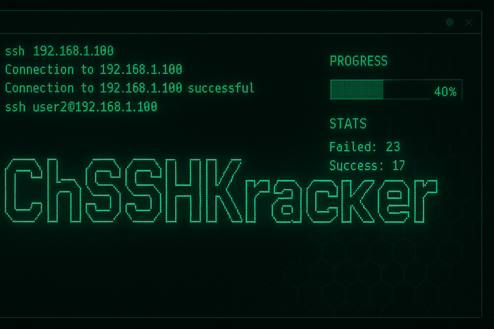
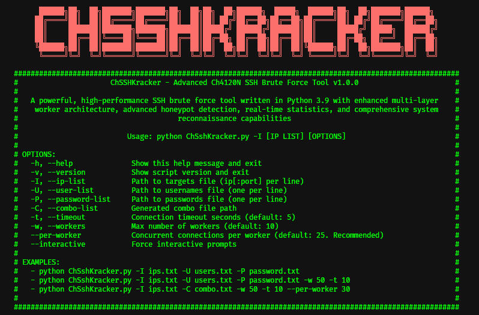
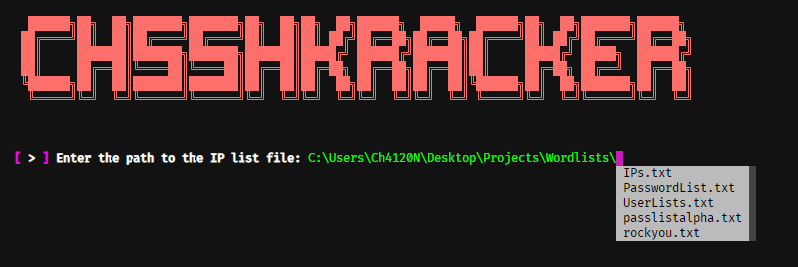
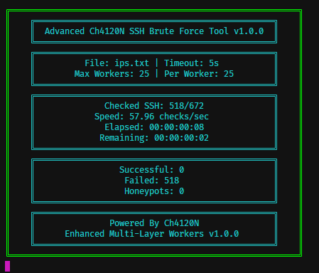

<!--
SEO Meta Tags
Title: ChSSHKracker - Advanced SSH Brute Force Tool with Honeypot Detection
Description: Powerful Python SSH brute force tool with multi-threaded architecture, advanced honeypot detection, real-time statistics, and system reconnaissance. Perfect for authorized security testing and penetration testing.
Keywords: SSH brute force, SSH cracker, penetration testing, security testing, honeypot detection, Python security tool, SSH scanner, network security, cybersecurity tool, paramiko SSH, multi-threaded SSH, security research
Author: Ch4120N
Language: en-US
Robots: index, follow
Open Graph:
  og:title: ChSSHKracker - Advanced SSH Brute Force Tool
  og:description: Powerful Python SSH brute force tool with honeypot detection for authorized security testing
  og:type: software
  og:url: https://github.com/Ch4120N/ChSSHKracker
Twitter Card:
  twitter:card: summary_large_image
  twitter:title: ChSSHKracker - Advanced SSH Brute Force Tool
  twitter:description: Powerful Python SSH brute force tool with honeypot detection
Structured Data (JSON-LD):
{
  "@context": "https://schema.org",
  "@type": "SoftwareApplication",
  "name": "ChSSHKracker",
  "applicationCategory": "SecurityApplication",
  "operatingSystem": "Windows, Linux, macOS",
  "programmingLanguage": "Python",
  "author": {
    "@type": "Person",
    "name": "Ch4120N",
    "email": "Ch4120N@Proton.me"
  },
  "description": "Advanced multi-threaded SSH brute force tool with honeypot detection",
  "license": "https://www.apache.org/licenses/LICENSE-2.0",
  "version": "1.0.0"
}
-->

<div align="center">



# ChSSHKracker

### _**Advanced Multi-Threaded SSH Brute Force Tool with Honeypot Detection**_


---

> **ChSSHKracker** is a powerful, high-performance SSH brute force tool written in Python with enhanced multi-layer worker architecture, advanced honeypot detection, real-time statistics, and comprehensive system reconnaissance capabilities. Perfect for **authorized security testing**, **penetration testing**, and **cybersecurity research**.

</div>

---

## 📋 Table of Contents

- 👨‍💻 [Project Programmer](#-project-programmer)
- 🧠 [Made For](#-made-for)
- 🖼️ [Screenshots / Preview](#️-screenshots--preview)
- ⚓ [Requirements](#-requirements)
  - 📦 [Installing Dependencies](#-installing-dependencies)
- ⚙️ [Installation Guide](#️-installation-guide)
  - [Linux](#linux)
  - [Windows](#windows)
  - [macOS](#macos)
- 💻 [Supported Platforms](#-supported-platforms)
- ✨ [Features](#-features)
  - 🎯 [Core Capabilities](#-core-capabilities)
  - 🛡️ [Security Features](#️-security-features)
  - 🎮 [User Experience](#-user-experience)
- 💻 [Usage](#-usage)
  - [Quick Start](#quick-start)
  - [Command Line Mode](#command-line-mode)
    - [Basic Usage](#basic-usage)
    - [Command Line Arguments](#command-line-arguments)
    - [Input File Formats](#input-file-formats)
  - [Interactive Mode](#interactive-mode)
- ⚙️ [Configuration](#️-configuration)
  - [Default Settings](#default-settings)
  - [Performance Tuning](#performance-tuning)
- 🔍 [Advanced Features](#-advanced-features)
  - [Honeypot Detection](#honeypot-detection)
  - [System Reconnaissance](#system-reconnaissance)
  - [Real-Time Statistics](#real-time-statistics)
- 📊 [Output Files](#-output-files)
  - [Output Format Example](#output-format-example)
- 🏗️ [Project Structure](#️-project-structure)
- ❤️ [Support the Project](#️-support-the-project)
- ⚠️ [Disclaimer](#️-disclaimer)
- 🚨 [Reporting Issues](#-reporting-issues)
- ❓ [Frequently Asked Questions (FAQ)](#-frequently-asked-questions-faq)
- 📄 [License](#-license)

---

## 👨‍💻 Project Programmer

> **Ch4120N** — [Ch4120N@Proton.me](mailto:Ch4120N@Proton.me)

---

## 🧠 Made For

> **Security researchers**, **penetration testers**, and **cybersecurity professionals** who need powerful **SSH brute force** capabilities with **advanced honeypot detection** for **authorized security testing**, **penetration testing**, and **network security assessment**.

---

## 🖼️ Screenshots

<div align="center">

| Main Interface | Interactive Mode | Statistics Display |
| :---: | :---: | :---: |
|  |  |  |

</div>

---

## ⚓ Requirements

- **Python 3.7+**
- **pip** (Python package manager)

### 📦 Installing Dependencies

```bash
python -m pip install -r requirements.txt
```

Or install manually:

```bash
python -m pip install cryptography==40.0.2 paramiko==2.11.0 colorama==0.4.6 prompt_toolkit==3.0.52
```

---

## ⚙️ Installation Guide

### Linux

```bash
sudo apt install python3 git -y
git clone https://github.com/Ch4120N/ChSSHKracker.git
chmod 755 -R ChSSHKracker
cd ChSSHKracker
python3 -m pip install -r requirements.txt
python3 ChSshKracker.py --help
```

### Windows

If you have Git installed:

```cmd
git clone https://github.com/Ch4120N/ChSSHKracker.git
cd ChSSHKracker
python -m pip install -r requirements.txt
python ChSshKracker.py --help
```

Otherwise, [download the ZIP release](https://github.com/Ch4120N/ChSSHKracker/releases), extract it, and run it directly.

### macOS

```bash
brew install python3 git
git clone https://github.com/Ch4120N/ChSSHKracker.git
cd ChSSHKracker
python3 -m pip install -r requirements.txt
python3 ChSshKracker.py --help
```

---

## 💻 Supported Platforms

- [x] **Linux** (All distributions)
- [x] **Windows** (7, 8, 10, 11)
- [x] **macOS** (All versions)

---

## ✨ Features

### 🎯 Core Capabilities

- **🚀 High Performance**: Multi-threaded architecture with configurable worker pools
- **🔄 Concurrent Processing**: Multiple concurrent connections per worker for maximum throughput
- **📊 Real-time Statistics**: Live progress tracking with detailed statistics
- **🎨 Beautiful UI**: Colorful terminal interface with ASCII banners and formatted tables
- **📝 Comprehensive Logging**: Detailed logs for successful connections, honeypots, and errors

### 🛡️ Security Features

- **🍯 Advanced Honeypot Detection**: Multi-layer detection system to identify honeypot traps
- **🔍 System Reconnaissance**: Automatic system information gathering after successful connection
- **⏱️ Configurable Timeouts**: Customizable connection timeouts to optimize performance
- **🛑 Graceful Shutdown**: Clean interruption handling with SIGINT support

### 🎮 User Experience

- **💬 Interactive Mode**: User-friendly interactive prompts for easy configuration
- **📁 Flexible Input**: Support for combo files or separate username/password lists
- **📈 Progress Tracking**: Real-time progress bars and statistics display

---

## 💻 Usage

### Quick Start

```bash
# Interactive mode (recommended for beginners)
python ChSshKracker.py --interactive

# Command line mode
python ChSshKracker.py -I ips.txt -U users.txt -P passwords.txt
```

### Command Line Mode

#### Basic Usage

```bash
# Using separate username and password files
python ChSshKracker.py -I ips.txt -U users.txt -P passwords.txt

# Using combo file (username:password format)
python ChSshKracker.py -I ips.txt -C combo.txt

# With custom timeout and workers
python ChSshKracker.py -I ips.txt -U users.txt -P passwords.txt -t 10 -w 50

# Advanced: Custom workers and concurrent connections per worker
python ChSshKracker.py -I ips.txt -C combo.txt -w 50 --per-worker 30 -t 10
```

#### Command Line Arguments

| Argument          | Short | Description                               | Default    |
| ----------------- | ----- | ----------------------------------------- | ---------- |
| `--ip-list`       | `-I`  | Path to targets file (ip[:port] per line) | Required   |
| `--user-list`     | `-U`  | Path to usernames file (one per line)     | Required\* |
| `--password-list` | `-P`  | Path to passwords file (one per line)     | Required\* |
| `--combo-list`    | `-C`  | Generated combo file path                 | Optional   |
| `--timeout`       | `-t`  | Connection timeout in seconds             | 5          |
| `--workers`       | `-w`  | Maximum number of worker threads          | 25         |
| `--per-worker`    |       | Concurrent connections per worker         | 25         |
| `--interactive`   |       | Force interactive prompts                 | False      |
| `--version`       | `-v`  | Show version and exit                     | -          |
| `--help`          | `-h`  | Show help message                         | -          |

\* Required if not using combo file

#### Input File Formats

**IP List (`ips.txt`):**

```
192.168.1.1:22
192.168.1.2:2222
192.168.1.5:8022
```

**Username List (`users.txt`):**

```
root
admin
user
test
```

**Password List (`passwords.txt`):**

```
password
123456
admin
root
```

**Combo File (`combo.txt`):**

```
root:password
admin:admin123
user:password123
```

### Interactive Mode

Launch the interactive mode for a guided setup:

```bash
python ChSshKracker.py --interactive
```

The interactive mode will prompt you for:

- IP list file path
- Username/password files or combo file
- Timeout settings
- Worker configuration
- Concurrent connections per worker

---

## ⚙️ Configuration

### Default Settings

The tool uses the following default configurations (defined in `core/config.py`):

```python
TIMEOUT = 5                    # Connection timeout in seconds
MAX_WORKERS = 25               # Maximum worker threads
CONCURRENT_PER_WORKER = 25     # Concurrent connections per worker
```

### Performance Tuning

**For High-Speed Networks:**

```bash
python ChSshKracker.py -I ips.txt -C combo.txt -w 100 --per-worker 50 -t 3
```

**For Slow/Unstable Networks:**

```bash
python ChSshKracker.py -I ips.txt -C combo.txt -w 10 --per-worker 5 -t 15
```

**Balanced (Recommended):**

```bash
python ChSshKracker.py -I ips.txt -C combo.txt -w 25 --per-worker 25 -t 5
```

---

## 🔍 Advanced Features

### Honeypot Detection

ChSSHKracker includes a sophisticated multi-layer honeypot detection system that analyzes:

- **Command Output Analysis**: Detects suspicious patterns in command responses
- **Response Time Analysis**: Identifies unnaturally fast response times
- **File System Analysis**: Checks for minimal or fake file systems
- **Process Analysis**: Detects known honeypot processes (Cowrie, Kippo, etc.)
- **Network Analysis**: Examines network configuration for anomalies
- **Behavioral Tests**: Tests system behavior and permissions
- **Performance Tests**: Analyzes system performance characteristics
- **Anomaly Detection**: Identifies suspicious hostnames and system information

Honeypots are automatically logged to `data/HONEYPOTS.TXT` and excluded from successful results.

### System Reconnaissance

Upon successful connection, the tool automatically gathers:

- System hostname and OS information
- Kernel version
- Uptime
- Network configuration
- Running processes
- File system structure
- User information

All reconnaissance data is saved to `data/SSH-DETAILES.TXT`.

### Real-Time Statistics

The tool provides real-time statistics including:

- Total tasks completed
- Successful connections
- Failed attempts
- Honeypots detected
- Current speed (attempts per second)
- Estimated time remaining
- Success rate percentage

---

## 📊 Output Files

All output files are saved in the `data/` directory:

| File               | Description                                            |
| ------------------ | ------------------------------------------------------ |
| `SSH-GOODS.TXT`    | Successful SSH connections (IP:PORT:USERNAME:PASSWORD) |
| `SSH-DETAILES.TXT` | Detailed information about successful connections      |
| `HONEYPOTS.TXT`    | Detected honeypot systems                              |
| `COMBO.TXT`        | Generated combo file (if not provided)                 |
| `debug.log`        | Debug logging information                              |

### Output Format Example

**SSH-GOODS.TXT:**

```
192.168.1.1:22:root:password123
192.168.1.5:22:admin:admin
```

---

## 🏗️ Project Structure

```
ChSSHKracker/
│
├── ChSshKracker.py           # Main entry point
├── requirements.txt          # Python dependencies
├── README.MD                 # This file
│
├── core/                     # Core functionality
│   ├── config.py             # Configuration and constants
│   ├── worker.py             # Multi-threaded worker implementation
│   ├── ssh_client.py         # SSH connection handler
│   ├── honeypot.py           # Honeypot detection engine
│   ├── recon.py              # System reconnaissance
│   ├── result_logger.py      # Result logging system
│   ├── stats.py              # Statistics tracking
│   ├── counter.py            # Progress counter
│   └── models.py             # Data models
│
├── cli/                      # Command-line interface
│   ├── parser.py             # Argument parser
│   ├── interactive.py        # Interactive mode
│   ├── formatter.py          # Help formatter
│   └── path_completer.py     # Path autocompletion
│
├── ui/                       # User interface components
│   ├── banner.py             # ASCII banners
│   ├── table.py              # Table rendering
│   ├── summary_render.py     # Summary display
│   ├── sharp_box.py          # Box drawing utilities
│   └── decorators.py         # Message decorators
│
├── utils/                    # Utility functions
│   ├── file_manager.py       # File operations
│   └── utility.py            # General utilities
│
├── data/                     # Data directory
│   ├── COMBO.TXT             # Generated combo file
│   ├── SSH-GOODS.TXT         # Successful connections
│   ├── SSH-DETAILES.TXT      # Detailed connection info
│   ├── HONEYPOTS.TXT         # Detected honeypots
│   └── debug.log             # Debug logs
│
└── images/                   # Screenshots directory
    ├── screenshot1.png
    ├── screenshot2.png
    └── screenshot3.png
```

---

## ❤️ Support the Project

If you find this tool useful, consider donating:

| Cryptocurrency | Address                                      |
| :------------- | :------------------------------------------- |
| **BTC**        | `bc1ql4syps7qpa3djqrxwht3g66tldyh4j7qsyjkq0` |
| **ETH**        | `0xfddbd535a4ad28792cbebceee3d6982d774e6d13` |
| **USDT**       | `3Cq6HRQsiwZFmPEQfG9eJkZE2QGChvf2VN`         |

> 💖 Your support helps keep the project alive and improving!

---

## ⚠️ Disclaimer

**This tool is for educational and authorized security testing purposes only.**

- ⚠️ **Unauthorized access to computer systems is illegal**
- ⚠️ **Only use this tool on systems you own or have explicit written permission to test**
- ⚠️ **The authors are not responsible for any misuse of this software**
- ⚠️ **Use responsibly and in compliance with applicable laws**

**By using this tool, you agree to use it only for legitimate security testing and educational purposes.**

---

## 🚨 Reporting Issues

> If you encounter bugs, configuration issues, or unexpected behavior, please reach out:
> 📩 **Ch4120N@Proton.me**

---

## ❓ Frequently Asked Questions (FAQ)

### What is ChSSHKracker?

ChSSHKracker is an **advanced SSH brute force tool** written in Python that combines **multi-threaded architecture** with **honeypot detection** capabilities. It's designed for **authorized security testing** and **penetration testing** purposes.

### Is this tool legal?

Yes, when used for **authorized security testing** on systems you own or have explicit written permission to test. Unauthorized access to computer systems is illegal. Always ensure you have proper authorization before using this tool.

### How does honeypot detection work?

ChSSHKracker uses a **multi-layer detection system** that analyzes command outputs, response times, file systems, processes, network configurations, and behavioral patterns to identify honeypot traps.

### What Python version is required?

**Python 3.7 or higher** is required. The tool uses modern Python features and libraries like `paramiko`, `colorama`, and `prompt_toolkit`.

### Can I use this on Windows?

Yes! ChSSHKracker is **cross-platform** and works on **Windows**, **Linux**, and **macOS**. See the [Installation Guide](#️-installation-guide) for platform-specific instructions.

### How do I report bugs or request features?

Contact the developer at **Ch4120N@Proton.me** or open an issue on the GitHub repository.

### Is there a GUI version?

Currently, ChSSHKracker is a **command-line tool** with an **interactive mode** for easier configuration. A GUI version may be considered for future releases.

### What makes ChSSHKracker different from other SSH brute force tools?

ChSSHKracker stands out with its **advanced honeypot detection system**, **real-time statistics**, **beautiful terminal UI**, **interactive mode**, and **comprehensive system reconnaissance** capabilities. It's specifically designed for **authorized security testing** with built-in safety features.


---

## 📄 License

This project is licensed under the Apache License 2.0 - see the [LICENSE](LICENSE) file for details.

```
Copyright 2025 Ch4120N

Licensed under the Apache License, Version 2.0 (the "License");
you may not use this file except in compliance with the License.
You may obtain a copy of the License at

    http://www.apache.org/licenses/LICENSE-2.0

Unless required by applicable law or agreed to in writing, software
distributed under the License is distributed on an "AS IS" BASIS,
WITHOUT WARRANTIES OR CONDITIONS OF ANY KIND, either express or implied.
See the License for the specific language governing permissions and
limitations under the License.
```

---

<div align="center">

"Powerful SSH brute force with advanced honeypot detection — one connection at a time."

**⭐ If you like this project, don't forget to give it a star!**

[](https://github.com/Ch4120N/ChSSHKracker)
[](https://github.com/Ch4120N/ChSSHKracker)

**Made with ❤️ by Ch4120N**

</div>
